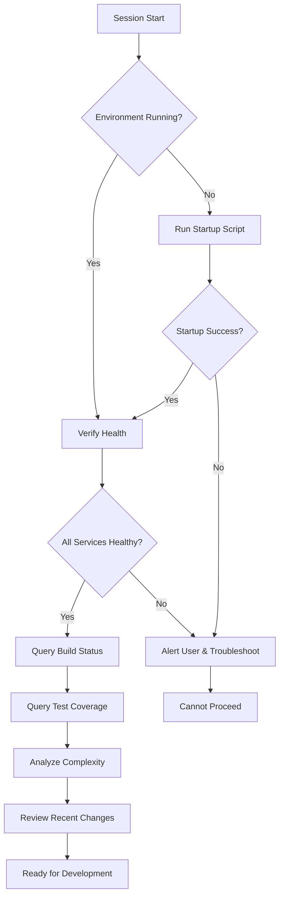

# Development Environment Startup Guide

**For AI Agents & Developers**

**Version:** 1.0.0
**Last Updated:** 2025-11-03
**Required Reading:** Before starting any development work

---

## 🎯 Purpose

This guide ensures that AI agents and developers always start the development environment correctly, with full observability and monitoring in place. **This must be followed at the beginning of every development session.**

---

## ✅ Pre-Flight Checklist

Before starting development, agents should verify:

```bash
# 1. Check if services are already running
curl -f http://localhost:3000/health > /dev/null 2>&1
if [ $? -eq 0 ]; then
  echo "✅ Development environment already running"
  exit 0
fi

# 2. Verify Docker is running (for observability stack)
docker ps > /dev/null 2>&1
if [ $? -ne 0 ]; then
  echo "❌ Docker not running - please start Docker Desktop"
  exit 1
fi

# 3. Verify required tools
command -v bun >/dev/null 2>&1 || echo "⚠️  Bun not found"
command -v xcodebuild >/dev/null 2>&1 || echo "⚠️  Xcode not found"
```

---

## 🚀 Starting the Environment

### Automated Startup (Recommended)

```bash
# From project root
./scripts/start-dev-environment.sh
```

**What this does:**
1. ✅ Validates all documentation
2. ✅ Starts Docker observability stack (Prometheus, Grafana, Jaeger, Loki, AlertManager)
3. ✅ Waits for observability services to be ready
4. ✅ Starts TypeScript monitoring server on port 3000
5. ✅ Displays comprehensive status with all URLs

**Expected output:**
```
✅ Development Environment Ready!
==========================================

📊 Observability URLs:
  TypeScript Server:
    - Health:        http://localhost:3000/health
    - API Root:      http://localhost:3000/
    - Build Status:  http://localhost:3000/api/swift/build/status
    ...
```

### Manual Startup (If Script Fails)

```bash
# 1. Start observability stack
cd agentic-workflow/observability
docker-compose up -d
cd ../..

# 2. Wait for services (30 seconds)
sleep 30

# 3. Start TypeScript server
cd agentic-workflow
bun run dev &
cd ..

# 4. Verify health
curl http://localhost:3000/health
```

---

## 🔍 Health Verification

After startup, agents **MUST** verify system health:

```bash
# Check TypeScript server
curl -f http://localhost:3000/health | jq '.status'
# Expected: "healthy"

# Check Prometheus
curl -f http://localhost:9090/-/ready
# Expected: HTTP 200

# Check Grafana
curl -f http://localhost:3001/api/health | jq '.database'
# Expected: "ok"

# Check Jaeger
curl -f http://localhost:16686
# Expected: HTTP 200
```

**Agent Behavior:**
- If ANY health check fails, **DO NOT proceed** with development
- Alert the user and suggest troubleshooting steps
- Reference: `agentic-workflow/docs/OBSERVABILITY.md#troubleshooting`

---

## 📊 Post-Startup Agent Actions

Once environment is running, agents should:

### 1. Query Initial Build Status
```bash
curl http://localhost:3000/api/swift/build/status | jq
```

**Decision Logic:**
- If `status == "failed"`: Prioritize fixing build errors
- If `errors > 0`: Review error messages before suggesting changes
- If `warnings > 10`: Consider addressing warnings

### 2. Check Test Coverage
```bash
curl http://localhost:3000/api/swift/tests/latest | jq '.coverage'
```

**Decision Logic:**
- If coverage < 70%: Suggest adding tests
- If coverage < 80%: Note in code review comments
- If coverage >= 80%: Continue normal development

### 3. Analyze Code Complexity
```bash
curl http://localhost:3000/api/swift/metrics | jq '.complexity.average'
```

**Decision Logic:**
- If average > 7: Recommend refactoring
- If average > 10: Strongly recommend breaking down functions
- If any file > 15: Flag for immediate review

### 4. Review Recent Changes
```bash
curl http://localhost:3000/api/swift/files/changes | jq '.changes | length'
```

**Use this to:**
- Understand what's been recently modified
- Avoid conflicts with ongoing work
- Contextualize current development session

---

## 🤖 Agent Startup Workflow



---

## 🛑 Stopping the Environment

```bash
# Stop TypeScript server
pkill -f "tsx watch"

# Stop observability stack
cd agentic-workflow/observability
docker-compose down
cd ../..
```

**Or use the auto-generated stop script:**
```bash
/tmp/stop-dev-env.sh
```

---

## 🚨 Common Issues & Solutions

### Issue: Port 3000 Already in Use
```bash
# Find process
lsof -i :3000

# Kill it
kill -9 <PID>

# Restart
./scripts/start-dev-environment.sh
```

### Issue: Docker Compose Fails
```bash
# Check Docker Desktop is running
open -a Docker

# Wait 30 seconds, then retry
sleep 30
cd agentic-workflow/observability
docker-compose up -d
```

### Issue: TypeScript Server Won't Start
```bash
# Check for compilation errors
cd agentic-workflow
bun run build 2>&1 | grep "error"

# If errors found, fix them before starting dev server
```

### Issue: Observability Services Not Ready
```bash
# Check container status
docker-compose -f agentic-workflow/observability/docker-compose.yml ps

# Check logs for specific service
docker-compose -f agentic-workflow/observability/docker-compose.yml logs prometheus
docker-compose -f agentic-workflow/observability/docker-compose.yml logs grafana
```

---

## 📝 Agent Checklist

Before making ANY code suggestions or changes, verify:

- [ ] Development environment is running (`./scripts/start-dev-environment.sh`)
- [ ] All health checks pass
- [ ] Build status queried and understood
- [ ] Test coverage reviewed
- [ ] Code complexity analyzed
- [ ] Recent changes reviewed
- [ ] Observability dashboards accessible

**If ANY item is unchecked, DO NOT proceed with development.**

---

## 🔗 Related Documentation

- **Observability Guide**: [`agentic-workflow/docs/OBSERVABILITY.md`](../agentic-workflow/docs/OBSERVABILITY.md)
- **API Reference**: [`agentic-workflow/docs/API.md`](../agentic-workflow/docs/API.md)
- **Agent Configuration**: [`.claude/config.yaml`](./config.yaml)
- **Development Principles**: [`agentic-workflow/docs/DEVELOPMENT_PRINCIPLES.md`](../agentic-workflow/docs/DEVELOPMENT_PRINCIPLES.md)

---

## 🎓 For New Agents

If you're a new agent joining this project:

1. **Read this document first** - Understand the startup requirements
2. **Review** `DOCUMENTATION_INDEX.md` - Understand the documentation structure
3. **Study** `agentic-workflow/docs/OBSERVABILITY.md` - Learn how to query the system
4. **Check** `.claude/config.yaml` - Understand your configured behaviors
5. **Run** `./scripts/start-dev-environment.sh` - Start the environment
6. **Verify** all health checks - Ensure everything is working
7. **Query** initial metrics - Get baseline understanding
8. **Begin** development - You're now ready!

---

**Remember:** The observability system is not optional. It provides critical insights that inform better development decisions. Always start with observability, always query before changing code.

---

**Last Validated:** 2025-11-03
**Maintained By:** Agentic Development Team
**Questions?** See `agentic-workflow/docs/OBSERVABILITY.md#troubleshooting`
